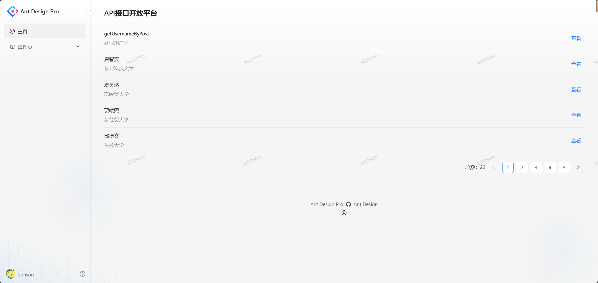
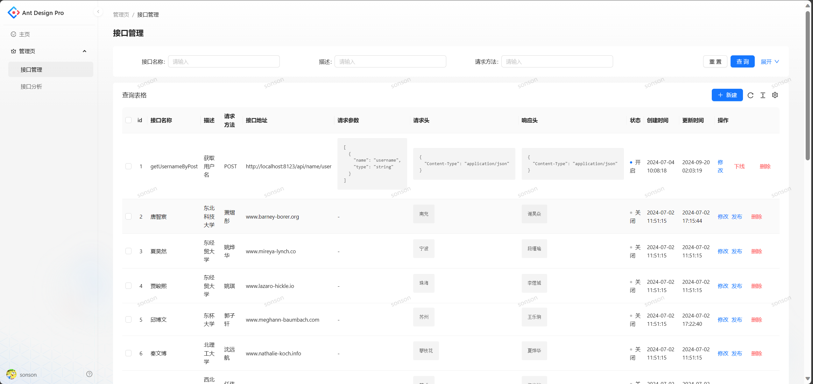
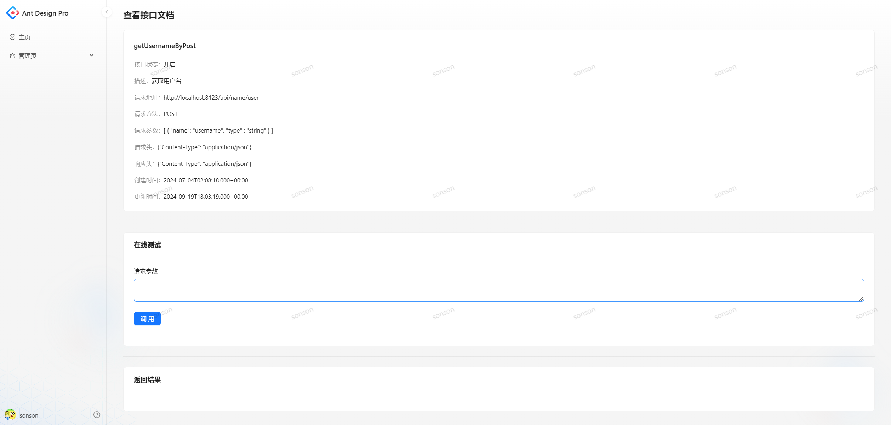
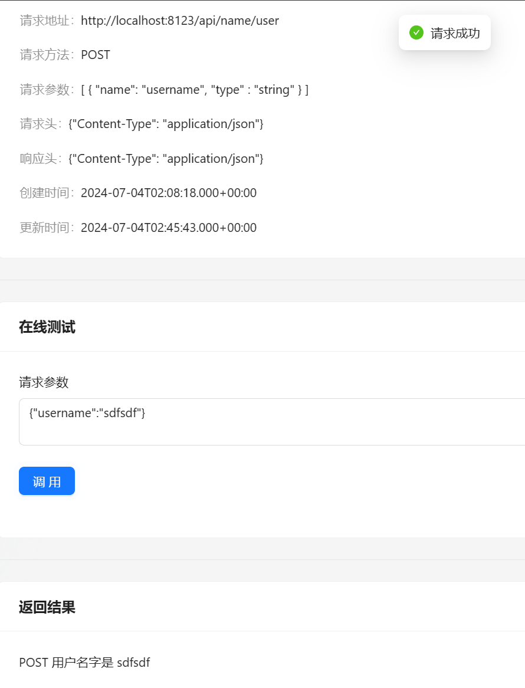
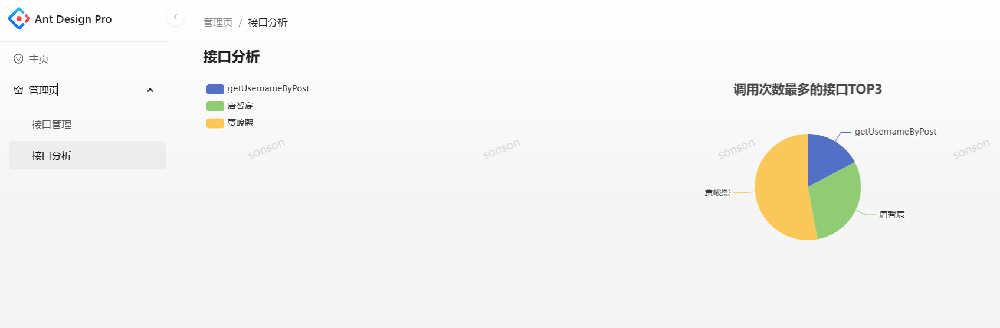
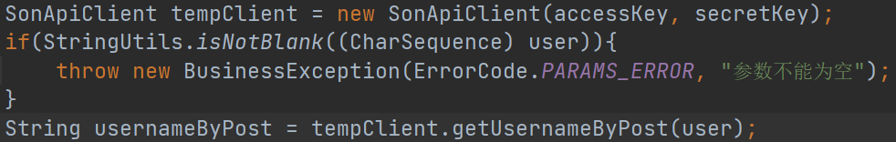
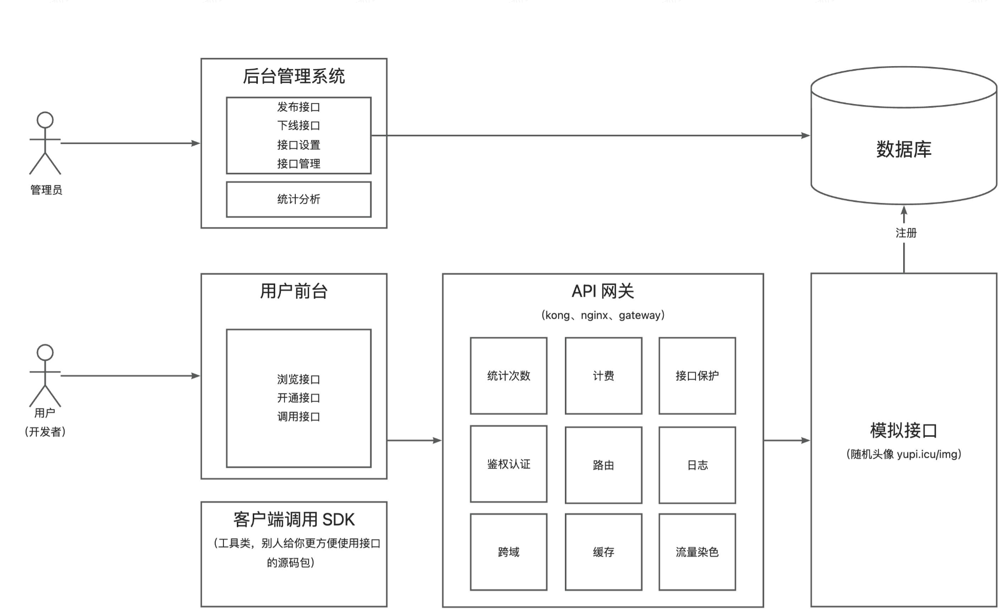

### API开放平台项目

> 背景：
>
> 1. 前端开发需要用到后台接口
> 2. 使用现成的系统的功能【http://api.btstu.cn/】
>
>
> 做一个API 接口平台：
>
> 1. 防止攻击（安全性）
> 2. 不能随便调用（限制、开通）
> 3. **统计调用次数**
> 4. 计费
> 5. 流量保护
> 6. API 接入

#### 1. 项目概述
1. 管理员可以对接口信息进行增删改查
2. 用户可以访问前台，查看接口信息

#### 2. 技术栈

###### 2.1.1 前端

- Ant Design Pro
- React
- Ant Design Procomponents
- Umi
- Umi Request(Axios的封装)

###### 2.1.2 后端

- Java Spring Boot
- Spring Boot Starter(SDK开发)
- Dubbo (RPC)
- Nacos
- Spring Cloud Gateway(网关、限流、日志实现)
#### 3. 演示界面

一个提供API接口供开发者调用的平台：

管理员可以发布接口，同时统计分析各接口的调用情况，用户可以注册登录并开通接口调用权限，浏览接口以及在线进行调试，并使用`SDK`轻松地在代码中调用接口

主页（浏览接口）：

接口管理：

查看接口详情：

在线调试：

接口调用分析：

使用自己开发的客户端SDK,一行代码调用接口：

业务流程图：

